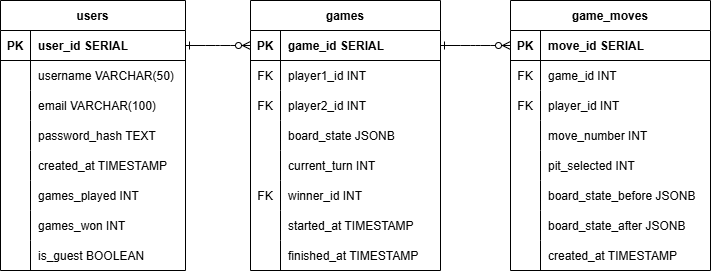

# <center>Develop Doc</center>

## I. 项目概述

### 1.1 项目简介

**项目目标**
制作网页版的 Kalah Game，能够进行本地双人对战，网上双人对战以及人机对战。

**项目目的**
我做这个项目的目的主要是为了训练自己软件开发的认知，包括软件的设计，后端开发，前端开发，测试和部署。

**项目描述**
Kalah 是一个有着悠久历史的播棋游戏，游戏本身很简单，没有太多复杂的逻辑要实现，因此我的开发主要着重于 web 游戏开发的通用部分，完成本地双人对战和网上双人对战后，我将着手开发 AI 来作为挑战。

### 1.2 功能需求

**Kalah 游戏规则**

1. 棋盘结构：
   - 每位玩家有 6 个 pits 和 1 个得分坑（Kalah）。
   - 初始状态下，每个坑里有 4 颗种子。
2. 游戏玩法：

   - 玩家轮流选择一个坑，从中取出所有种子，按顺时针方向逐个分发到后续的坑中。
   - 如果最后一颗种子落在自己的 Kalah，该玩家获得额外回合。
   - 如果最后一颗种子落在自己空的坑，且对面坑有种子，玩家可捕获对面坑的种子，并放入自己的 Kalah（自己的一颗种子也放入）。

3. 游戏结束：
   - 当一方的 6 个坑全为空，游戏结束。
   - 另一方将剩余种子全部归入其 Kalah。
   - Kalah 中种子最多的玩家获胜。

目标：通过策略分配种子、争取额外回合、捕获对手种子，以最大化 Kalah 的得分。

**Login and Signup**

**Two Player Local 模式**

- local 对战的逻辑完全写在前端，以减少服务器请求。
- 游戏结束后，弹窗提示获胜者以及分数比。
- 游戏结束后，可选择再来一局或回到主菜单。

**Two Player Online 模式**

- 联网对战的逻辑完全写在后端。
- 玩家可以创建房间或者浏览房间大厅加入别人的房间。
- 对战记录会存储在后端。
- 玩家可查看自己的对战记录：对战局数和胜率。

**One Player AI 模式**

**Setting**

### 1.3 非功能需求

- 性能需求
- 兼容性
- 安全性
- 可用性：无障碍设计

---

## II. 技术架构

### 2.1 技术栈

- Frontend
  - 前端框架：React + Vite + Tailwind CSS
  - 前端状态管理：Redux
  - 前端通信：WebSocket
  - 动画：Framer Motion
- Backend
  - 后端框架：FastAPI
  - 后端通信：WebSocket + REST API
- Database
  - PostgreSQL + Redis
- AI
- DevOps

### 2.2 系统架构图

### 2.3 模块设计

**后端架构:** MSC (Modal - Service - Controller)
`[models] <- [services] <- [routes(Controller)] <- [Frontend React]`

```bash
backend/
│── app/
│ ├── main.py
│ ├── config.py
│ ├── db/
│ │ ├── database.py
│ │ ├── init.sql
│ ├── models/
│ │ ├── user_model.py
│ ├── services/
│ │ ├── user_service.py
│ ├── routes/
│ │ ├── user_routes.py
│ ├── schemas/
│ │ ├── user_schema.py
│── .gitignore
│── dockerfile
│── README.md
│── requirements.txt
```

**前端架构**

```bash
frontend/
├── public/
│ ├── logo.svg
├── src/
│   ├── assets
│   ├── components
│   ├── pages
│   ├── routes
│   ├── services
│   ├── store
│   ├── utils
│   ├── types
│   ├── App.tsx
│   ├── main.tsx
├── tests
```

---

## III. 数据结构和 API

### 3.1 数据库设计

**数据库需求分析**

- 我们的 Kalah Game 支持用户联机对战，因此要有用户注册，登录功能，要储存用户的名字，密码和邮箱，此外还要存储用户的创建时间。
- 联机对战的胜率统计，我们要存储用户的对战次数和胜场。
- 有游客模式，要存储用户是否为游客。

**ER Graph**



**SQL DDL** [SQL DDL](../backend/app/db/init.sql)

### 3.2 API 文档

### 3.3 后端技术细节

在 FastAPI 里，我们通常用 SQLAlchemy 定义 Model，用 Pydantic 定义 Schema。Model 用来操作数据库，Schema 用来验证前端传来的数据校验。

---

## IV. 前端设计

### 4.1 UI

主界面：选择模式

- 本地双人对战
- 人机对战
- 在线对战

**本地双人对战**

### 4.2 前端路由

### 4.3 响应式设计

---

## V. QA

---

## VI. DevOps

**Git**

- 代码托管：GitHub
- Git 分支策略：
  - main（生产环境）
  - develop（开发环境）
  - feature（新功能）
  - bugfix（修复）
  - hotfix（紧急修复）
- 提交规范: Conventional Commits
  - feat： 新增 feature
  - fix: 修复 bug
  - docs: 仅仅修改了文档，比如 README, CHANGELOG, CONTRIBUTE 等等
  - style: 仅仅修改了空格、格式缩进、逗号等等，不改变代码逻辑
  - refactor: 代码重构，没有加新功能或者修复 bug
  - perf: 优化相关，比如提升性能、体验
  - test: 测试用例，包括单元测试、集成测试等
  - chore: 改变构建流程、或者增加依赖库、工具等
  - revert: 回滚到上一个版本

**CI/CD**

CI/CD 工具：GitHub Actions / GitLab CI/CD / Jenkins
自动化流程：

前端：npm test + npm run build
后端：pytest + black 代码格式化
Docker 容器化 并部署到 AWS/GCP
Kubernetes 滚动更新

**容器化技术：Docker + Docker Compose**

初始化数据库表: 使用 docker-entrypoint-initdb.d 自动执行 SQL:创建 init.sql 并放入 docker-entrypoint-initdb.d/ 目录 PostgreSQL 的官方 Docker 镜像 会在启动时 运行 docker-entrypoint-initdb.d 目录下的 SQL 文件。

---

## Questions

**问题：宿主机无法连接 Docker 中运行的 PostgreSql** （Solved）

运行连接命令: `psql -h localhost -U kalah_user -d kalah_db` 返回 `psql: 错误: 连接到"localhost" (::1)上的服务器，端口5432失败：致命错误:  用户 "kalah_user" Password 认证失败`

1. 确保 PostgreSql 正在运行: `docker ps`（Pass）
2. 确保 PostgreSQL 正在监听 5432 端口（Pass）
   - 进入 postgres_db 容器: `docker exec -it postgres_db psql -U kalah_user -d kalah_db`
   - 查看监听的地址: `SHOW listen_addresses;`
3. 尝试是否可以使用 Docker 容器的 IP 连接（Pass）
   - `docker inspect -f '{{range .NetworkSettings.Networks}}{{.IPAddress}}{{end}}' postgres_db`
   - `psql -h xxx.xx.x.x -U kalah_user -d kalah_db`
4. 修改 postgresql.conf 为监听所有 IP（Pass）
   - 查看监听的所有 IP: `docker exec -it postgres_db cat /var/lib/postgresql/data/pg_hba.conf`
   - `docker exec -it postgres_db bash -c "echo 'host all all 0.0.0.0/0 md5' >> /var/lib/postgresql/data/pg_hba.conf"`
   - `docker restart postgres_db`
5. 检查是否存在宿主机端口占用问题 （Solution）
   - `netstat -ano | findstr :5432` 查看 5432 端口有没有被占用。
   - 关闭本机服务或者修改宿主机暴露的端口，比如`5431:5432`

**问题：启用后端热重载**

- docker 的 volumes 可以建立起本地文件和 docker 文件的映射关系，这样本地文件改变后，docker 文件也会改变，unicorn 监听文件改变，热重载生效。
- 启用热重载失败，以及一些找不到`main`文件之类的 bug 一般都是由于路径设置不正确导致的。
- 启用 volumes 后，就不用在 dockfile 中 copy 静态代码了。

**问题: docker 启动时端口被占用**

- winnat

**问题: 每次在本地安装 npm 包，重启 docker 后，docker 仍然找不到此包**

```
docker-compose down --volumes
docker-compose build --no-cache
docker-compose up -d
```

---

## Reference
